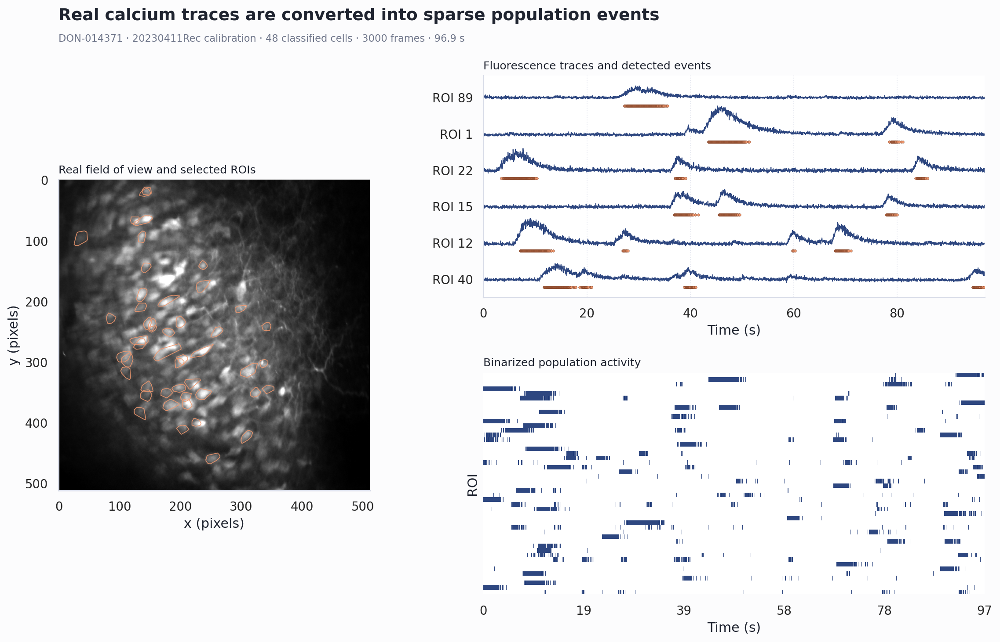
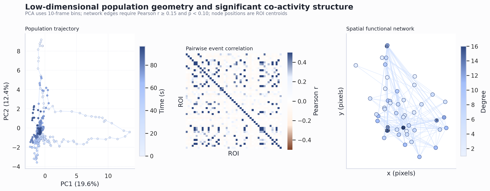

# Open-CaBCI_tools

**Analysis tools to dissect population dynamics in calcium-based Brain-Computer Interface experiments. Companion package to [Open-CaBCI](https://github.com/donatolab/Open-CaBCI).**

---

## Overview

Open-CaBCI_tools provides calcium-trace processing, fluorescence binarization, ROI-footprint handling, population-dimensionality analysis, pairwise correlation analysis, and functional-network utilities for BCI experiments.

This repository includes a compact real-data demonstration that runs representative core functions, saves numerical results, and produces publication-ready figures without requiring microscope hardware or the full manuscript dataset.

---

## Associated Publication

**[Equivalent volitional learning emerges through circuit-specific population dynamics in motor cortex and hippocampus](https://www.biorxiv.org/content/10.64898/2026.06.04.730137v1)**

Andres de Vicente\*, Catalin Mitelut\*, Renan Viana Mendes, Lorenzo Marianelli, Mariona Colomer Rosell, David Bruckner, Giampiero Bardella, and Flavio Donato

\*Equal contribution | Correspondence: flavio.donato@unibas.ch

bioRxiv 2026.06.04.730137 | doi: [10.64898/2026.06.04.730137](https://www.biorxiv.org/content/10.64898/2026.06.04.730137v1)

> 📢 **If you use Open-CaBCI_tools in your research, please cite the above publication.**

---

## Core Demonstration

The bundled demonstration uses 48 classified neurons and 3,000 frames (96.9 seconds) from the calibration recording of `DON-014371/20230411Rec`. The 3.2 MiB subset retains real Suite2p fluorescence, neuropil, deconvolved spikes, ROI footprints, mean image, classifier output, and source cell IDs.

The demonstration exercises:

1. `Calcium.load_suite2p()` for real Suite2p files.
2. `Calcium.load_footprints()` for ROI geometry.
3. `compute_dff0()` for neuropil-corrected ΔF/F.
4. `Calcium.binarize()` for event detection and saved binary activity.
5. `Calcium.compute_PCA()` for population geometry.
6. `get_corr2()` for pairwise event correlations.
7. Network utilities for thresholding, graph construction, and degree statistics.

### Visual outputs

**Calcium processing and binarization** — shows the real field of view and ROI contours, representative ΔF/F traces with detected events, and the complete population raster.



**Population geometry and network structure** — shows the time-resolved PCA trajectory, pairwise event-correlation matrix, and spatial functional network.



These figures are examples from the bundled dataset, not cohort-level manuscript results.

---

## System Requirements

The demonstration was tested with:

- Ubuntu 22.04.5 LTS, x86-64
- Python 3.9.13
- Standard desktop CPU; no GPU or non-standard hardware is required
- 4 GB RAM or more
- Approximately 1 GB free disk space, including the Python environment and outputs

Exact tested dependency versions are recorded in `requirements.txt`.

---

## Installation

Clone the repository and create an isolated environment:

```bash
git clone https://github.com/andrestrocyte/Open-CaBCI_tools.git
cd Open-CaBCI_tools

python3 -m venv .venv
source .venv/bin/activate
python -m pip install --upgrade pip
python -m pip install -r requirements.txt
```

Installation normally takes 3–5 minutes on a recent desktop with a broadband connection.

---

## Run the Demo

From the repository root:

```bash
python examples/run_core_demo.py
```

The measured runtime on the tested workstation was 6.5 seconds; allow approximately 10–60 seconds on a normal desktop.

Expected terminal summary:

```text
"cells": 48
"frames": 3000
"active_fraction": 0.05402083333333333
"network_nodes": 47
"network_edges": 163
Saved numerical results: .../examples/outputs/demo_results.npz
```

The script saves:

| Output | Description |
|---|---|
| `examples/outputs/binarized.npy` | Binarized activity, cells × frames |
| `examples/outputs/demo_results.npz` | ΔF/F, binary activity, PCA, correlations, adjacency, degree statistics, and metadata |
| `examples/outputs/demo_pca.pkl` | Fitted scikit-learn PCA model |
| `examples/outputs/demo_pca.npy` | Population PCA embedding |
| `examples/outputs/correlation_pairs.npy` | Pairwise cell correlations and p-values |
| `examples/outputs/network_edges.csv` | Significant graph edges with source cell IDs |
| `examples/outputs/summary.json` | Compact machine-readable run summary |
| `examples/outputs/*.png`, `*.svg` | Raster and vector versions of both figures |

All outputs are reproducible for the bundled data and can be regenerated by rerunning the command.

---

## Run on Your Suite2p Data

Provide a Suite2p `plane0` directory containing:

```text
plane0/
├── F.npy
├── Fneu.npy
├── spks.npy
├── iscell.npy
├── ops.npy
└── stat.npy
```

Then run:

```bash
python examples/run_core_demo.py \
  --data /absolute/path/to/suite2p/plane0 \
  --output /absolute/path/to/demo_outputs
```

Optional analysis thresholds:

```bash
python examples/run_core_demo.py \
  --threshold 2.0 \
  --network-threshold 0.15
```

`--threshold` is the per-cell fluorescence event threshold in standard deviations. `--network-threshold` is the minimum positive Pearson correlation retained after requiring `p < 0.10`.

---

## Python API

The core calcium object is available from the package root:

```python
from bmitools import Calcium

calcium = Calcium()
calcium.data_dir = "/absolute/path/to/suite2p/plane0"
calcium.load_suite2p()
calcium.load_footprints()
```

The analysis modules under `bmitools/analysis/` contain the original exploratory workflows used for behavior, alignment, calcium population, ensemble, dimensionality, and network analyses. They generally require the full laboratory data hierarchy and should be adapted to the target experiment.

---

## Test Data

The bundled data are a deterministic subset of:

```text
/media/cat/8TB/donato/bmi/DON-014371/20230411Rec/calibration/suite2p/plane0
```

The 48 highest-variance classified cells in the first 3,000 frames were selected and then restored to source cell order. No synthetic calcium values were introduced. Complete provenance, source IDs, and SHA-256 checksums are provided in `test_data/README.md` and the session `metadata.json`.

---

## Repository Structure

```text
Open-CaBCI_tools/
├── bmitools/                       core and exploratory analysis modules
├── examples/
│   ├── run_core_demo.py            reproducible end-to-end demonstration
│   └── outputs/                    saved numerical and visual results
├── test_data/                      compact real Suite2p dataset
├── requirements.txt                exact tested dependencies
├── setup.py                        package metadata
├── LICENSE                         GPL-3.0 license
└── README.md
```

---

## Scope

The bundled demonstration validates representative core operations and visual outputs. It does not reproduce every exploratory notebook or the cohort-level quantitative results in the manuscript, which require the complete study dataset and session hierarchy.

---

## Credits

This repository builds on tools originally developed by **Catalin Mitelut** ([@catubc](https://github.com/catubc/bmi_tools)). We are grateful for his foundational contributions.

---

## License

This project is licensed under the [GPL-3.0 License](LICENSE).

---

## Contact

**Donato Lab** | Biozentrum, University of Basel<br>
🌐 [donatolab.com](https://www.donatolab.com) | ✉️ flavio.donato@unibas.ch
